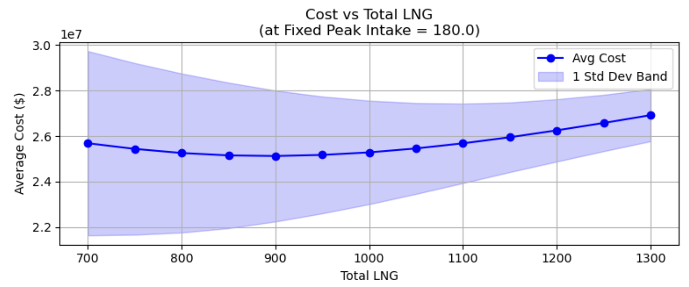
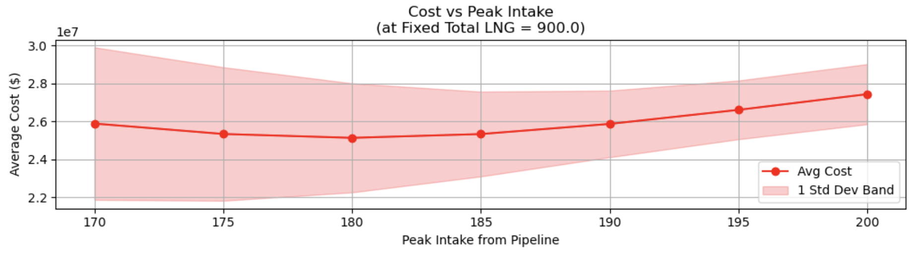

# CaLNG Supply Chain Optimization

## Project Overview
This project optimizes the LNG procurement strategy for a utility company under uncertain demand. Using **Monte Carlo Simulation** (5,000 draws), we identify the optimal balance between a fixed **Take-or-Pay contract** and the volatile **Pipeline Spot Market**.

## Key Findings
Based on the optimization results, the parameters that minimize the expected seasonal cost are:
* **Optimal Total LNG:** 900.0 MMcf
* **Optimal Peak Pipeline Intake:** 180.0 MMcf
* **Minimum Expected Cost:** ~$25.13M

## Optimization Visualizations
The charts below illustrate the cost trade-offs. The shaded area represents the **1-Standard Deviation Band**, showing the financial risk associated with demand volatility.

| Cost vs Total LNG | Cost vs Peak Intake |
| :---: | :---: |
|  |  |
| *Holding Peak Intake at 180.0* | *Holding Total LNG at 900.0* |

## Analysis & Strategic Insights

### 1. Financial Feasibility (Take-or-Pay)
The Take-or-Pay contract is financially sound. At 900 MMcf, the utility minimizes the risk of being forced into the expensive pipeline spot market during peak winter days.

### 2. Risks Faced by CaLNG
CaLNG faces **Volume Risk** (if demand is lower than expected, lead to storage gluts) and **Market Price Risk** (if pipeline spot prices drop significantly below the contract price of $7.5).

## Project Structure
Below is the directory structure for this repository:

```text
.
├── README.md                           # Project documentation and summary
├── CaLNG_Optimization_Analysis.ipynb    # Main Python notebook with simulation code
└── plots/                              # Folder containing generated visualizations
    ├── cost_vs_peak_intake.png         # Plot of cost sensitivity to pipeline intake
    └── cost_vs_total_lng.png           # Plot of cost sensitivity to LNG contract volume
